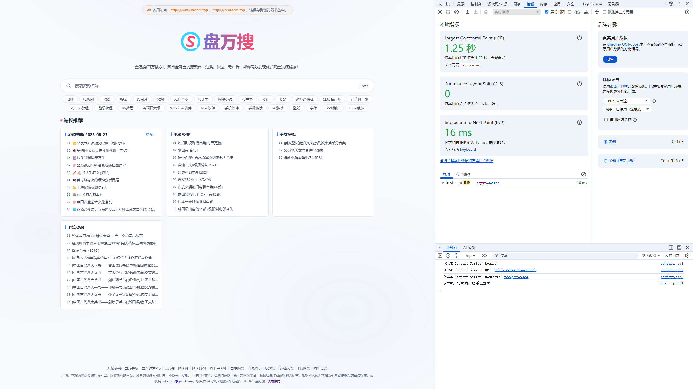

# 盘万搜(百万搜索) | www.panws.net

百万搜索是免费网盘搜索引擎，聚合百度网盘、夸克网盘、UC网盘、迅雷云盘、阿里云盘、115网盘等多平台网盘资源，支持网盘搜索与资源下载，一键获取资源链接，覆盖电影、电视剧、动漫、软件、学习资料、音乐、电子书等，无需登录注册，作为网盘资源搜索神器与资源网站，快速无广告，每日更新。

在线访问：[<https://www.panws.net/>](https://www.panws.net/)



## 功能

- 跨网盘聚合搜索：一次输入，同时检索多个网盘平台的公开分享
- 资源类型覆盖：电影、电视剧、动漫、综艺、软件、学习资料、音乐、电子书
- 每日热门更新：按日聚合各网盘热门分享，提供时间维度的资源发现
- 资源详情页：展示资源名、所属网盘、分享链接，直达网盘保存或下载
- 全站静态化：预渲染输出，访问速度快，无 JS 渲染依赖

## 支持的网盘平台

百度网盘、夸克网盘、UC网盘、迅雷云盘、阿里云盘、115网盘

## 使用方式

1. 访问： [<https://www.panws.net/>](https://www.panws.net/)
2. 搜索框输入资源关键词（电影名、剧名、软件名等）
3. 从结果列表选择资源，进入详情页
4. 详情页获取网盘分享链接，前往对应网盘保存或下载

## 技术栈

- 站点框架：Astro 静态站点生成
- 部署平台：Vercel
- 资源索引：自建多网盘公开分享索引，每日自动更新

## 声明

本站仅聚合互联网公开分享的网盘资源链接，不存储任何资源文件。如有侵权请联系删除。


---

# 从零构建全网盘资源搜索引擎：Astro + Supabase 实战


我做了一个**全网盘聚合搜索引擎**，支持百度/夸克/阿里/迅雷/115/UC等11个平台。

**盘万搜(百万搜索) → [https://www.panws.net](https://www.panws.net)**

**阿卡搜 → [https://www.vecom.top](https://www.vecom.top)**


## 完整功能清单

### 核心功能
- ✅ **11网盘聚合搜索** - 百度/夸克/阿里/迅雷/115/UC/天翼/移动/123/PikPak/光猫
- ✅ **链接存活检测** - 自动批量检测，失效链接不浪费一次点击
- ✅ **网盘类型筛选** - 按百度/夸克/阿里等分类筛选结果
- ✅ **分页加载** - 支持 15/20/30/50/100 条/页

### 首页功能
- ✅ **百度热搜榜** - 电影/电视剧/小说/短剧 4 个榜单，5分钟更新
- ✅ **夸克榜单** - 热门资源实时更新
- ✅ **豆瓣榜单** - 高分电影/剧集推荐
- ✅ **站长推荐** - 精选优质资源，分类展示
- ✅ **每日热门** - 按日期聚合热门资源
- ✅ **热门关键词** - 快速跳转热门搜索

### 用户系统
- ✅ **验证码激活** - 关注公众号获取验证码，7天有效期
- ✅ **QQ频道引流** - 扫码加入网盘交流频道
- ✅ **宅家副业** - 副业项目推荐

### 技术特性
- ✅ **多数据库支持** - Supabase/Neon/Turso 一键切换
- ✅ **全网搜索兜底** - DB结果不足时，自动调用第三方搜索API
- ✅ **深色模式** - 自动跟随系统/手动切换
- ✅ **响应式设计** - 移动端完美适配
- ✅ **View Transitions** - 无刷新页面切换

### SEO 优化
- ✅ **结构化数据** - JSON-LD WebSite/SearchAction/BreadcrumbList
- ✅ **Open Graph** - 社交分享优化
- ✅ **Sitemap.xml** - 动态生成，含 lastmod
- ✅ **Robots.txt** - 多搜索引擎配置
- ✅ **Canonical 标签** - 防止重复内容
- ✅ **Meta 标签** - title/description/keywords 完整

### 部署 & 分析
- ✅ **双平台部署** - Vercel + Netlify 一键切换
- ✅ **51LA 统计** - 访问数据分析
- ✅ **Google AdSense** - 广告变现（可关闭）
- ✅ **缓存策略** - 静态资源1年/API12小时/详情页1天

---

## 技术选型

### 为什么选 Astro 而不是 Next.js？

| 对比项 | Astro | Next.js |
|--------|-------|---------|
| 首屏加载 | ⚡ 极快（纯HTML） | 较快（JS Bundle） |
| 包体积 | 📦 极小 | 📦 较大 |
| SSG 支持 | ✅ 原生 | ⚠️ 需配置 |
| SSR 支持 | ✅ 按需开启 | ✅ 默认开启 |
| 学习曲线 | 📚 简单 | 📚 较陡 |

**结论**：内容型网站首选 Astro，SaaS 应用选 Next.js。

### 数据库选择

```javascript
// site.config.js - 切库只需改一行
dbSource: 'supabase',  // 或 'neon' | 'turso'
```

| 数据库 | 全文搜索 | 免费额度 | 适用场景 |
|--------|----------|----------|----------|
| Supabase | PGroonga | 500MB | 中文搜索首选 |
| Neon | pg_trgm | 512MB | PostgreSQL 原生 |
| Turso | FTS5 | 9GB | 边缘部署 |

---

## 核心代码实现

### 1. 数据库适配层

```javascript
// src/lib/database/index.js
const ADAPTERS = {
  supabase: {
    module: () => import('./supabase.js'),
    searchLinks: (mod) => mod.supabaseSearchLinks,
  },
  neon: {
    module: () => import('./neon.js'),
    searchLinks: (mod) => mod.neonSearchLinks,
  },
  turso: {
    module: () => import('./turso.js'),
    searchLinks: (mod) => mod.tursoSearchLinks,
  },
};

// 动态加载适配器
async function getModule() {
  const source = siteConfig.dbSource;
  const adapter = ADAPTERS[source];
  const mod = await adapter.module();
  return { searchLinks: adapter.searchLinks(mod) };
}
```

### 2. PGroonga 中文搜索

```sql
-- 启用 PGroonga
CREATE EXTENSION IF NOT EXISTS pgroonga;

-- 创建索引
CREATE INDEX idx_resources_search 
ON resources USING pgroonga(title);

-- 搜索查询
SELECT * FROM resources 
WHERE title &@~ '三体'
ORDER BY created_at DESC
LIMIT 20;
```

### 3. 链接存活检测

```javascript
// 批量检测链接
async function batchCheck(urls) {
  const results = await Promise.allSettled(
    urls.map(url => checkLink(url, { timeout: 5000 }))
  );
  return results.map((r, i) => ({
    url: urls[i],
    alive: r.status === 'fulfilled' && r.value,
  }));
}
```

### 4. 全网搜索兜底

```javascript
// 搜索页 - DB不足时触发第三方搜索
const showExternalTrigger = searchCfg.enabled
  && !errorMsg && q.length >= 2
  && data.rows.length < (searchCfg.triggerThreshold ?? 5);
```

### 5. 验证码激活系统

```javascript
// site.config.js
activation: {
  enabled: true,
  validDays: 7,
  wechatName: '百万运营',
  keyword: '芝麻开门',
}
```

### 6. 榜单数据

```javascript
// 百度热搜榜 - 5分钟更新
showBaiduRank: true,
baiduRankMaxItems: 12,

// 夸克榜单
showQuarkRank: true,
quarkRankMaxItems: 12,

// 豆瓣榜单
showDoubanRank: true,
doubanRankMaxItems: 12,
```

---

## 部署配置

### Vercel

```json
{
  "headers": [
    {
      "source": "/_astro/(.*)",
      "headers": [
        { "key": "Cache-Control", "value": "public, max-age=31536000, immutable" }
      ]
    }
  ]
}
```

### Netlify

```toml
[build]
  command = "npm run build"
  publish = "dist"

[[headers]]
  for = "/_astro/*"
  [headers.values]
    Cache-Control = "public, max-age=31536000, immutable"
```

---

## 性能数据

| 指标 | 数值 |
|------|------|
| 首屏加载 | < 1s |
| 搜索响应 | < 500ms |
| Lighthouse | 95+ |
| 索引页面 | 200+ |
| 网盘类型 | 11种 |

---

## 项目结构

```
pan.newmt.fun/
├── src/
│   ├── components/      # 组件
│   │   ├── ActivationModal.astro  # 验证码弹窗
│   │   ├── BaiduRank.astro        # 百度热搜榜
│   │   ├── QuarkRank.astro        # 夸克榜单
│   │   ├── DoubanRank.astro       # 豆瓣榜单
│   │   ├── FeaturedLinks.astro    # 站长推荐
│   │   ├── FriendLinks.astro      # 友情链接
│   │   └── GoogleAd.astro         # 广告组件
│   ├── layouts/         # 布局
│   ├── lib/             # 工具库
│   │   ├── database/    # 多数据库适配
│   │   └── utils.js     # 工具函数
│   ├── pages/           # 页面
│   │   ├── index.astro  # 首页
│   │   ├── search.astro # 搜索页（SSR）
│   │   ├── detail/      # 详情页
│   │   ├── guide/       # 使用指南
│   │   └── hot/         # 每日热门
│   └── styles/          # 样式
├── public/              # 静态资源
│   ├── hot-daily/       # 热门数据
│   └── data/            # 站长推荐
└── site.config.js       # 全局配置
```

---

## 开源地址

[GitHub 仓库 →](https://github.com/scenlinx/pan.newmt.fun)


如果你也在做类似的项目，欢迎交流！


